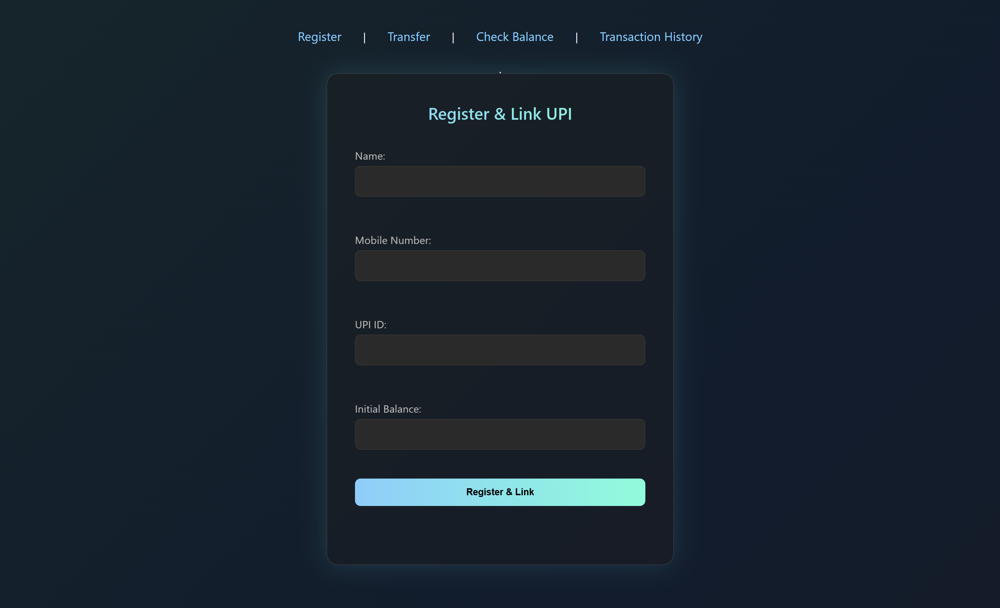
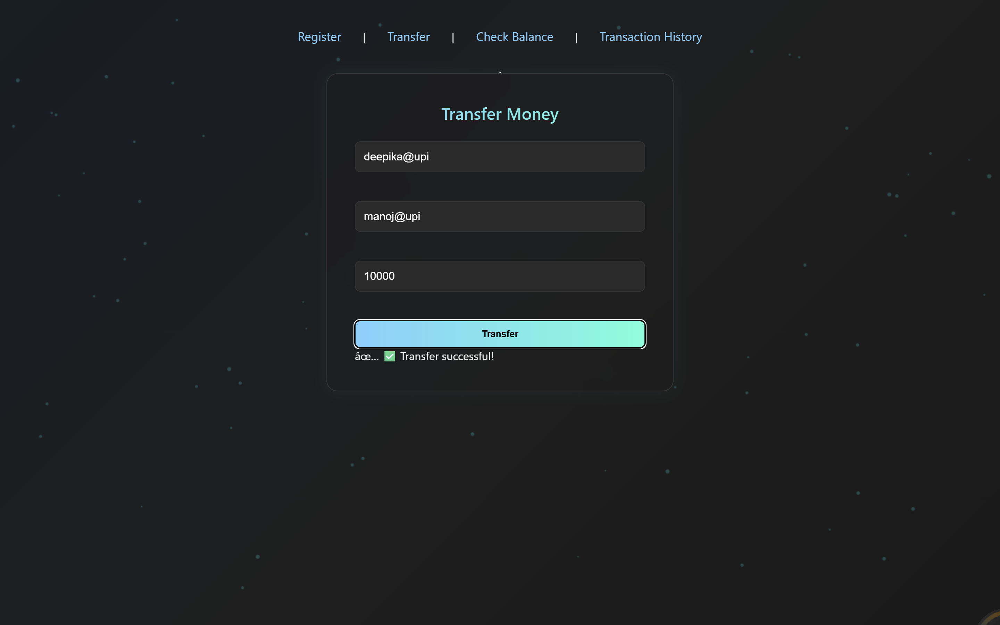
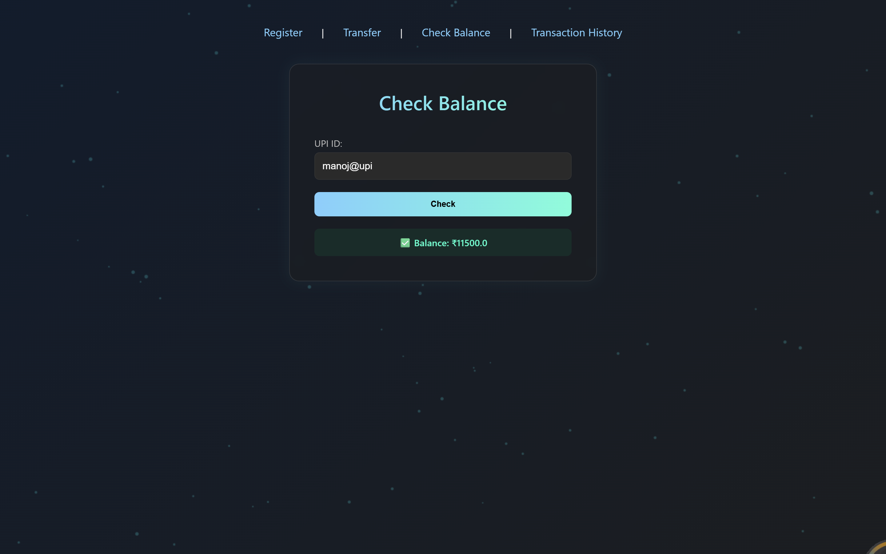
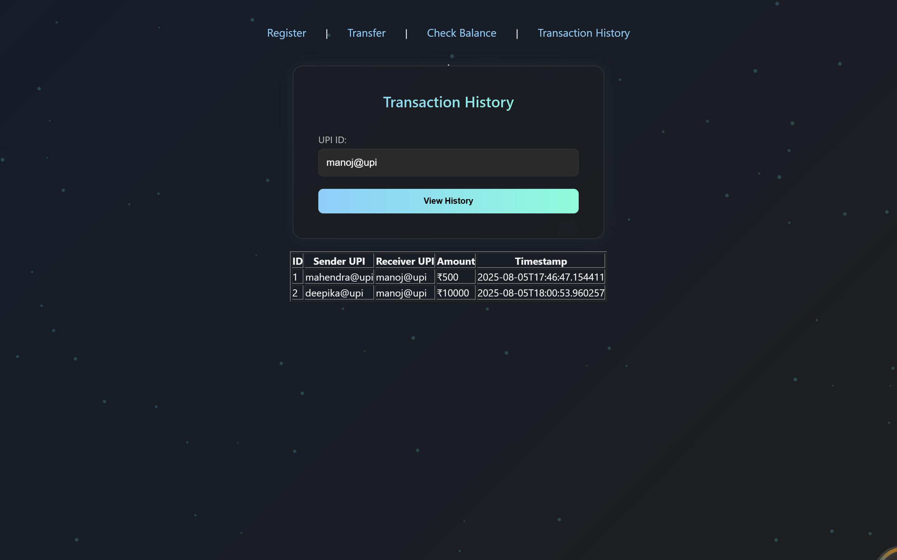

# 💸 PayPort - UPI Payment System

PayPort is a simplified UPI-based payment system built using **Java**, **Spring Boot**, **MySQL**, and a static **HTML/CSS/JS frontend**. It allows users to register, link accounts, transfer money, check balance, and view transaction history — all through a user-friendly UI.

---

## 📁 Project Structure

\`\`\`
PayPort/
│
├── Frontend/                         # Initial static frontend (not served)
├── payment/
│   ├── src/
│   │   ├── main/
│   │   │   ├── java/com/payport/    # Spring Boot backend code
│   │   │   └── resources/
│   │   │       └── static/          # HTML, JS, CSS files served by Spring Boot
│   ├── pom.xml                      # Maven build config
│   └── application.properties       # App config
\`\`\`

---

## 🚀 Features

- 👤 User registration and UPI account linking (combined form)
- 💰 Balance check and money transfer
- 📜 Transaction history
- 🖥️ Clean frontend interface using HTML, CSS, JS
- 🐘 Backend built with Spring Boot, REST APIs, MySQL

---

## 🛠️ Tech Stack

- **Backend:** Java, Spring Boot, Spring Data JPA
- **Frontend:** HTML, CSS, JavaScript
- **Database:** MySQL
- **Build Tool:** Maven

---

### 5. Access the Web App

\`\`\`
http://localhost:8080/register.html
\`\`\`

---

## 📸 Screenshots

 
 

 

---

## 📬 API Endpoints (Optional)

| Endpoint               | Method | Description              |
|------------------------|--------|--------------------------|
| \`/register\`          | POST   | Register new user        |
| \`/transfer\`          | POST   | Transfer money           |
| \`/balance\`           | GET    | Get account balance      |
| \`/history\`           | GET    | Get transaction history  |

---

## 🙋‍♂️ Author

**Y Manoj Kumar**  
Integrated M.Tech CSE | VIT University  
🔗 [LinkedIn](https://www.linkedin.com/in/manojkumaryennameedhi)

---

